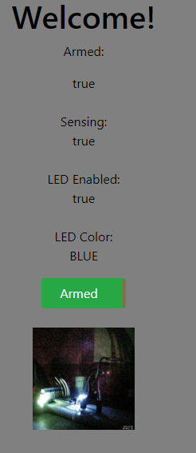
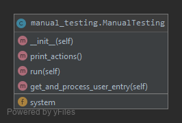

\newpage{}

# Revision History

| **Description** | **Date** | **Revision number** |
| --- | --- | --- |
| Initial proposal submission | 9/27/2019 | v1 |
| Final report submission | 12/4/2019 | v2 |
|   |   |   |

\newpage{}

# Executive Summary
Our group project during the Fall 2019 semester in CEN 5035 Software Engineering will be a Smart Security System. 
We have found there is a lack of flexibility to set up schedules for a security system which lead us down this path. 
We are looking to solve this problem by having an easily configurable way to schedule when the alarm should be enabled 
or disabled. This system will also have the standard features of a typical alarm system.

The Smart Security System breaks away from the competition in its  ability to connect to and utilize with the owner’s 
digital calendar to automatically create a detection schedule. To reduce the risk of  failure, the system will also have 
a backup keypad to enable or disable the detection system in the event the Google Calendar schedule was not enough.

The security system will include cutting edge passive infrared motion sensing technology to be able to detect any 
movement in the desired location. For added security, the system will capture images, video and audio to relay back to 
the system owner and or authorities should a break-in occur. The system will also have the ability to disable the alarm 
from the web interface. Giving the owner a short time frame to disregard the event before the authorities are notified.
Finally the system will have a secured web interface to be able to view and update the monitoring schedule through the 
Google Calendar. The web system will provide the user the ability to activate or disarm the alarm and view a live stream 
of their camera at any given time. 

Our target audience will be for anyone who wants to have a security system that has a busy schedule where they might be 
traveling often. This will help ensure that the alarm system will always be active when the home owner is away. 
\newpage{}

# Competitive Analysis
## Simple feature comparison
|   | ADT Pulse | Vivint | Ring Alarm | FrontPoint | SimpliSafe | Smart Security System |
| --- | --- | --- | --- | --- | --- | --- |
| **24/7 Monitoring** | X | X | X | X | X | X |
| **Live Alerts** | X | X | X | X | X | X |
| **Motion Detection** | X | X | X | X | X | X |
| **Voice Control** | O | X | X | X | X | X |
| **Arm/Disarm Remotely** | X | X | X | X | X | X |
| **Schedule sync** | O | O | O | X | O | X |

|Symboal| Meaning|
|---|---|
|X |Includes|
|O |Excludes |

## Detailed feature comparison
|   | ADT Pulse | Vivint | Ring Alarm | FrontPoint | SimpliSafe | Smart Security System |
| --- | --- | --- | --- | --- | --- | --- |
| **Installation** | Professionals will come out to install equipment and set up. ADT does not provide self-installations | Requires professional installations at an additional cost | DIY installation | Equipment is intended for DIY installation. Saving money on installation fees | Customers set up own equipment, DIY installation taking less than 30 minutes | Equipment is easy to set up, self-installations |
| **Monitoring Options** | Monitoring is done through their trained operators from monitoring centers. | Performs monitoring in-house and at monitoring center | 24/7 monitoring services and personal in-house monitoring | Monitoring is done at a monitoring center with 2 central stations | Monitoring is handled by a company, COPS. Customers can also review footage | Self monitoring available at no additional cost |
| **Third Party Capability** | Compatible with Amazon Alexa, Kwikset, Z-Wave, and Google Assistant | Third party capability with Google Home, Z-Wave and Smart Hub | Compatible with other smart home devices such as Alexa or Z-Wave  | Third party capability with Alexa, Google Home and Z-Wave. | Compatible with Alexa and Google Home only | N/A |
| **Cost** | Cost for a monthly subscription for monitoring and equipment - contract requirement for number of months | Monthly subscription for monitoring and equipment - a certain number of months contract or paid in full | Pay in full for equipment, no subscription necessary | Subscription monthly for monitoring and equipment packages - no contract required | Monthly subscription for monitoring and equipment packages  - no contract required | No monthly subscription, pay in full for equipment which includes all that is necessary |

## Competitive Relationship
Our Smart Security System is easy to use and easy to set up. Our simple yet very useful features allow our system to ensure 
security within one’s home. Our system allows the user to feel safe at all times by just simply syncing their schedule and 
being able to arm and disarm their system whenever they are away. They will have self-monitoring and able to view a live stream whenever.

## Competitive Advantage
An advantage that our Smart Security System is that the system will be able to connect up with the owner’s digital schedule. T
here is only one other system that has that capability, FrontPoint. The advantage our system has over FrontPoint, 
along with the other systems, is the ability to receive these alerts quick enough in order to determine whether the alert 
was real or not. Our system will be able to notify authorities quickly enough after confirmation. 

# Data Definition
- Enable/arm - Turning the system on to monitor for intruders.
- Active - Currently the system monitoring for intruders or any disturbance from the motion sensors.
- Disarm - The act acknowledging the system of a false alarm or making the system inactive meaning that the system is no 
monitoring for movement.
- Notification - sending an alert through a SMS/MMS to the system owner.
- System owner - User in control of the system who can enable/disable the system.
- Detect - System has found a disturbance from one of the motion sensors.
- Monitor - the act of checking the sensors to see if the signals are out of normal range.
- Record - Using the PS3 Eye to capture video and or pictures and save it to the system.
- Sensing - This the period where the system has been Armed and the waiting period has lapsed. During this time
if there has been activity spotted by the PIR then the alarm will be activated.
- Locked - The system we become locked upon 4 incorrect pin entries.

# Overview of Scenarios and Use Cases
**Use Case: Enable Alarm**

**Brief Description** : System owner arms the monitoring service

**Basic Flow** :

1. System owner chooses to enable monitoring service
2. System asks for code to arm monitoring service
    * System owner enters correct pin
    * System will arm and LED indicator will flash 5 times and LED will set to blue
3. System Owner is notified that monitoring service has been armed on via SMS notification

**Alternate Flow** :

1. System Owner chooses to enable monitoring service
2. System asks for code to arm monitoring service
    * Code provided is incorrect, system allows for 5 more incorrect tries
    * Code provided is incorrect, system is locked for 5 minutes
3. System Owner is notified that system is locked via SMS notification

** **

**Use Case: Disable Alarm**

**Brief Description** : System owner disarms monitoring service

**Basic Flow** :

1. System owner chooses to disable monitoring service
2. System asks for code to disarm monitoring service
    * System owner enters keypress to disarm monitoring service
    * Once disarmed, LED indicator will flash 5 times and LED will be turned off
3. System Owner is notified that monitoring service has been disarmed via SMS notification

**Alternate Flow** :

1. System Owner chooses to disable monitoring service
2. System asks for code to disarm monitoring service
   * Code provided is incorrect, system allows for 5 incorrect tries
   * Code provided is incorrect, system is locked for 5 minutes
3. System Owner is notified that monitoring service has been disarmed via SMS notification

** **

**Use Case: Notify System Owner**

**Brief Description** : System notifies system owner if monitoring service was triggered

**Basic Flow:**

1. Monitoring service is triggered
2. Monitoring service takes a picture of surrounding perimeter
3. Monitoring service takes a video of surrounding perimeter
4. System Owner is notified that an event has occurred
    * Latest image is sent to system owner via SMS notification
    * A link to a live stream of the video is sent to system owner via SMS notification

        
# High-Level functional requirements
## Detection System
- **HLR.REQ-1** - The system shall monitor user designated areas for any signs of movement when the system has been armed.

## Automated Monitoring Calendar
- **HLR.REQ-2** - The system shall provide the user with a calendar that can be utilized to schedule times when the system should arm and disarm automatically.
- **HLR.REQ-31** - The system shall be able to detect new calendar events within 10 seconds.

## Recording System
- **HLR.REQ-3** - The system shall stream video, and audio from an area designated by the user. 
- **HLR.REQ-4** - The system shall capture pictures and record audio/video when the system has been armed and triggered.

## User Interface
- **HLR.REQ-5** - The user interface shall have the ability to view the live stream. 
- **HLR.REQ-6** - The interface shall provide the user the ability to view and edit the monitoring calendar from the Google Calendar. 
- **HLR.REQ-7** - The system shall provide the user with the ability to arm and disarm the system.
- **HLR.REQ-28** - The user interface shall provide the color and enabled status of the LED
- **HLR.REQ-29** - The user interface shall have a link to the Watson service

## Alert System
- **HLR.REQ-8** - The system shall flash the LED green 5 times and then lock on blue for a successful arming of the system.
- **HLR.REQ-22** - The system shall flash the LED green 5 times and the shut off the LED for a successful disarming of the system.
- **HLR.REQ-23** - The System shall flash the LED yellow 2 times when the pin was incorrectly entered
- **HLR.REQ-24** - The system shall continue to flash red when the system alarm becomes activated
- **HLR.REQ-26** - The system shall become locked when the PIN was incorrectly entered 4 times in a row
- **HLR.REQ-27** - The system shall remain locked for 5 minutes when the system becomes locked. 
- **HLR.REQ-25** - The system shall turn the LED on red when the system becomes locked

## Reporting System
- **HLR.REQ-9** - The system shall send messages to the user when the system has been armed and triggered. 
- **HLR.REQ-19** - The notifications shall have an image capture when the trigger happened, the date & time, and a link to the stream.
- **HLR.REQ-20** - The system shall send a notification when the system has been armed.
- **HLR.REQ-21** - The system shall send a notification when the system has been disarmed.

## Watson 
- **HLR.REQ-30** - The system shall send the following events to the Watson service to be able to graph:
  - Arming/Disarming the system
  - System Alarm triggered
  - Motion detected

# List of non-functional requirements

- **HLR.REQ-11** - The system shall handle erroneous inputs from the user.
- **HLR.REQ-13** - The system shall be easy to learn, taking no more than 15 minutes for new users to start utilizing all of the system's features.
- **HLR.REQ-14** - The user interface shall be capable of being accessed from any device with internet access.
- **HLR.REQ-16** - The system shall restrict read/write/modify access to video/audio streams,  pictures, video/audio recording to the owning user.
- **HLR.REQ-17** - The system shall respond to user reporting feedback within 60 seconds.
- **HLR.REQ-18** - The system shall store 1GB of video recordings and 250MB of pictures.

# High-Level System Architecture
 
\begin{figure}[!h]
\caption{System Architecture }
\end{figure}
Link:[https://www.draw.io/#G1RfKGCpj4uxjit77ksxuVJuZhFB1gMUyB](https://www.draw.io/#G1RfKGCpj4uxjit77ksxuVJuZhFB1gMUyB)

From the Intruder actor they are monitored from the PIR motion sensor and the Ultrasonic Sound Sensor. When the system detects
the intruder, the Video camera will start recording and take a picture when the disturbance occurred. The intruder will see the
LED flashing red letting them know that the alarm has been sounded. The Owner actor will receive a notification when the Intruder 
trips the system. The user can view the video stream from the web interface. The Owner will also have the ability to modify
the Google calendar to set a monitoring schedule. The Owner actor will also have the ability to activate the system using the keypad.

\
\begin{figure}[!h]
\caption{Activity Flow diagram between Keypad, system, and sensor thread}
\end{figure}
Link: [https://www.draw.io/#G1uPLhlLkEPWDTnYCvWuJ4w6HXwep1SSEe](https://www.draw.io/#G1uPLhlLkEPWDTnYCvWuJ4w6HXwep1SSEe)

# Implementation details
## Inputs
### PIR Sensor
The PIR Sensor will be use to detect movement within a room. For this project we will be using the HC-SR501 PIR Motion
Sensor. PIR stands for Passive Infrared which means it doesnt use any energy to detect signals
The PIR sensor consist of a main compost of the pyroelectric sensor which when exposed to heat generates an 
electric signal. A warm body emits infrared radiation(IR) and this pyroelectric sensor picks up this IR signals. On top 
of the pyroelectric sensor there is a fresnel lens bounces the IR signals onto the pyroelectric sensor.

\
\begin{figure}[!h]
\caption{HC-SR501 PIR sensor}
\end{figure}

#### PIR Sensor pin description 

This PIR Sensor has 3 different pins: power, ground, and the output. The output pin will give a 5v or a 0v signal 
representing if the sensor has detected anything. 5v being that the sensor has detected IR signals and 0v for lack of 
IR signals. The power is expected to use 5v-20v input with 65mA current consumption.  

#### Adjusting the PIR Sensor
The PIR Sensor module has 2 potentiometers.
1. Adjusting the sensitivity of the sensor to reach up tp 7 meters 
2. Adjusting the time the output signal stays high when IR signals have been detected The time can be adjusted between
0.3 seconds to 5 minutes.

#### Trigger modes
The PIR Sensor module has a set of 3 pins to select the different types of trigger modes. 
1. Non-repeatable trigger mode : This is when the PIR Sensor has been triggered and the output time has lapsed, the 
output signal will automatically go back to zero 
2. Repeatable trigger mode : Similar to mode 1 but once the output time has lapsed and the IR signals still are detected
the output would remain high.
In a security system the Repeatable trigger mode is what we are looking for. For different applications like backyard 
light for night where you might only want to have it on for a short period of time.

#### PIR Sensor stabilization 
The PIR Sensor when powering up need to have about a minute to stabilize to adjust to the area before any valid outputs 
will occur. The average IR gets computed during this time and when a warm body comes into range, thats where the spike 
of IR signal will occur causing the PIR Sensor to signal activity has occurred. 

#### PIR Sensor add ons

The HC-SR501 PIR Motion Sensor has the ability to connect up to a few other modules right on this board for different
applications. You can add alight sensitive resistor or a photo resistor. This can be used with the PIR Sensor so that it
will make it only active in the dark. There is another place to add a thermal sensor which can factor readings into the
PIR Motion Sensor.

#### Initial testing
Before connecting up the Raspberry Pi this PIR Sensor can be tested without reading the output values pin. To do this
experiment there needs to be an LED connected from the output pin to he ground pin. After the PIR Sensor has stabilized
the LED will then turn on when IR signals have triggered the PIR Sensor. This was a good way to test out the PIR Sensor
before adding any of the complexity of the Raspberry Pi.

#### Interference
Late into the project we experienced some weird behaviors where the PIR sensor would keep triggering movement even though there was
no movement in the room. After some research it looked like it could have been the Raspberry Pi Bluetooth module and/or 
the WiFi module causing interference. Turning off the Bluetooth module did not help and and we needed to have the WiFi on 
in order to connect to the internet. That being said we decided to add in another monitoring sensor as a back up which was the Ultrasonic Sound Distance Sensor.

Source for some of this data: https://www.youtube.com/watch?v=ZC_sEW3_694

### 4x4 Membrane Matrix Switch
In typical security systems the Smart Security System needed a physical device for a user to arm and disarm the security system.
The sensor kit that we used had a 4x4 membrane matrix switch that would work perfectly in our prototype. 

This keypad has 16 individual keys but our Raspberry Pi only has a limited number of inputs. That means we need to multiplex 
the keys in order to achieve less inputs into the Raspberry Pi. Here are the following steps in order to achieve our matrix 4x4 for all 16 keys
1. Set the columns as outputs to High
2. Set the rows pints as inputs with pull-up resistors
3. While checking for an individual key has been pressed, 1 at a time the output will be set to Low.
4. While the 1 output is set to low, we will check if any of the inputs as set to Low, this will indicate that a button 
    as been pressed
5. In order to avoid sending multiple keypress events while the button is held down, the system will wait till that 
    Low becomes High again
    
System design on how to use the keypad class: 
https://drive.google.com/file/d/1uPLhlLkEPWDTnYCvWuJ4w6HXwep1SSEe/view?usp=sharing

The Keypad creates its own thread to capture all the key presses and then sends each key press into the queue.
The intention would be there is a separate thread that would process the keys using the queue

\
\begin{figure}[!h]
\caption{4x4 Matrix membrane switch}
\end{figure}

### Playstation Eye Camera
When looking for camera modules for the Raspberry Pi there were many different options. Some camera modules used the on board camera
connections but they ended up being more expensive. It was a surprise that the PS3 Eye which was intended for the Playstation 3 for
their motion controllers were the lowest cost at $10 and they had support for the Raspberry Pi's using the motion library. This made 
an easy decision and was relatively easy to integrate with the Raspberry Pi. We did have to end up upgrading the USB Power supply to 
Raspberry Pi to make sure it would get enough current to support driving the PS3 Eye.

\
\begin{figure}[!h]
\caption{PS3 Eye}
\end{figure}

### Ultrasonic Sound Distance Sensor(HC-SR04)
The HC-SR04 was a late addition to the hardware components but was required due to challenges with the PIR sensor which was 
highlighted in the PIR Sensor section. The Ultrasonic Sound Distance sensor is an amazing little device that uses sound to 
measure distance to the 3mm resolution. It can measure distances between 2cm and up to 4m or 13 feet which is perfect for our prototype.

#### How it works
The Ultrasonic Sound Sensory works by shooting out 40kHz sound from 1 speaker and then listening using the other speaker for the sound to return. 
Using the speed of sound we can calculate how far an object is from the sensor. There are 4 pins on the device: ground, 
vcc(5v power), echo, and trigger. In the software the Trigger pin is set to high for 1 microsecond, then we measure the 
time it takes for the echo pin to go from low to high and back to low. We can calculate the distance with the following formula:
$$ distance = time * speed$$
  We know the time in micro seconds. The speed is the speed of sound which is 340 m/s. We can then use this formula to calculate the distance in cm: 
$$distance = measured time * 34300/2$$
We divide by 2 since the distance was down and back.

\
\begin{figure}[!h]
\caption{HC-SR04 Ultrasonic Distance Sensor}
\end{figure}

## Outputs
### LED Module
The LED module is the main localized visual to let the system owner know what the system is doing. This LED will give live feedback in
the event the user enters the PIN from the keypad acknowledging of a successful entry or a bad entry. This is an RGB led that allows
for red, green, blue or any combination of the colors to represent status of the system. It was found out that the only combination of colors that was dent was green and red to make yellow.

\
\begin{figure}[!h]
\caption{HC-SR04 Ultrasonic Distance Sensor}
\end{figure}

## Services

### Watson Graphs

The IBM Watson service has a ton of different things from processing speech to text, text to speech, searching things
online, and many more. While investigating how Watson could be integrated with the Smart Security system it was found
that Watson could create time series graphs of events. This complemented the Smart Security system well since we have
many different events such as movement detection, arming the system, and when the alarm is sounded.

Integrating the Watson graphs were relatively easy to set up. The events just needed to be created from the Watson web
interface and then the system just needed to connect up to Watson and send the defined events.  

Here are some pictures of the graphs that Watson creates

\
\begin{figure}[!h]
\caption{Alarm activation}
\end{figure}

\
\begin{figure}[!h]
\caption{Movement Detection}
\end{figure}

\
\begin{figure}[!h]
\caption{System Armed}
\end{figure}

#### Challenges

Ideally it would be nice to embed these graphs in our user interface but it doesn't look like Watson has the capability
to share these graphs publicly. The only way you can view them is to be on an authorized email list and you have to
login to IBM's Watson system.

#### Considerations

For the Smart Security system we considered using voice activation to arm and disarm the system but in the end it seemed
like a security risk in the event that it didn't function properly or if an unauthorized user found out about the verbal
pass code. Possibly in the future when Watson can self identify someone based on their void then this could be a great
feature to add to this Smart Security System

###  Google Calendar as smart enable system
The concept of the Smart Security System would leverage the use of the Google Calendar to know when the system should
be monitoring for intruders. The system will periodically monitor for calendar updates. It will also activate and
deactivate the alarm system based on which events are running.

#### Determining when to monitor

There can be a few different ways to determine when the alarm system should be activated.

1. Alarm only on during meetings - With little interactions this will make it simple for the system to only be monitoring
when there is a meeting happening. This could be problematic too because its possible that someone might be working from
home and they might have a false positive . A way to combat this will be introduced in the next option

2. Labeled meetings - Adding some keyword to signify if during this meeting the system should be be monitor mode. This
does leave some room for error if someone forgets to tag the meeting that the system should be monitoring.

3. Complete separate alarm events - Another option would be to completely separate the events in their own type of meeting
to signify only for monitoring.

4. First and Last meetings - Automatically create a range where the system will be active the start of the first meeting
till the end of the last meeting. This still has holes since some meetings might take place at the home of the system owner.

Due to the time constraints we will be using 1, for our purposes to show that we can interact with the Google Calender

#### Considerations

Along with the alarm events is possible to connect up with the user's phone GPS to allow for the system to automatically
activate based on the GPS coordinates. Having some kind of range when someone leaves 0.5miles from home then the system
could be activated automatically.

### Motion library 

Since the semester is a short time frame our team tried to leverage as much open source software as much as possible. 
Our initial setup of getting the PS3 Eye Camera working used a library called motion. This library is highly configurable 
and can support many different types of cameras. It was not designed specifically for the Raspberry Pi but has supporting 
plugins to help communicate to the cameras. Its intended platform is Linux based and was also intended to be used as a 
way to monitor multiple cameras. Project website: https://motion-project.github.io/motion_config.html

This library was used to capture images from the PS3 eye and also record video when requested. When viewing the live 
stream the image will update once a second. Because the Raspberry Pi doesn't have a strong CPU, the stream only updates 
the image once a second. It is possible to update to have more frames per second but based on the research the Raspberry 
Pi can get bogged down quickly and we don't want this library to interfere with the main security system.

### Flask framework

The Flask web framework was selected by the team due to its ease of use for both constructing web pages and its use of the
python language for server side execution. While PHP would have also been valid the use of familiar python modules like
socket and json allowed the team to easily integrate the web page to pull live data from the system itself. As implied by
the modules above, the web server communicates to the system through a simple socket interface. The client passes a json request
and if properly formatted the system will execute the function and send back data or a simple confirmation. The web page itself
utilizes a simple javascript block that leverages ajax requests to call the web server functions which in turn communicates through
the local socket to the system. This back and fourth gives the web server the ability to perform any actions available to a local user
of the system and the ajax requests allow the web page to change dynamically and without constantly refreshing in the web browser.

\begin{figure}[!h]
\caption{UI when the system has been disarmed}
\end{figure}

\begin{figure}[!h]
\caption{UI when the system is armed}
\end{figure}

\begin{figure}[!h]
\caption{UI when the system alarm has been triggered showing red LED on}
\end{figure}

### Twilio notifications
Twilio is a Cloud Communication Platform as a Service (CPaaS) company that allows developers to send and receive text 
messages using its web service APIs. We chose Twilio because it is easily integrated into most systems and the Twilio 
website provides tutorials on how to integrate Twilio into your code.

To integrate Twilio, we first needed to sign up for a free Twilio account. From there we added the Twilio Communications 
REST API to a notifications python script. Twilio provides users with an account identification number as well as an 
authorization token. Once the user verifies the number that will
receive the messages, the user can configure the fields for sending the messages. Below is the template for sending a message on Twilio:
client.messages.create(
    body="body of the messages",
    from="the number that was chosen on Twilio
    to="the number the messages is being sent to"
    )

#### Considerations

Our team also considered using IBM Watson Push Notifications to send notifications in the event of the system being triggered but Twilio was chosen instead for it's ease of use.

## Class Diagrams
### System class
{ width=40% }

### Sys Client
{ width=40% }

### LED module
{ width=40% }

### Keypad

### PIR Sensor

### PIR Event
{ width=50% }

### Notifications

### Ultrasonic Distance Sensor

### Watson

### System Integration Testing

### Manual Testing

## Development Environment setup
Since our team was made up of people in many different locations we needed a good way to communicate, develop, and test our system. 
For our source control and task management, we used GitHub. It was a nice way to organize our work and prioritize what needed to get done.
In order to use the actual Raspberry Pi remotely there needed to be some channels opened up to allow for file transfer and remote access.
FTP/SSH was opened up for that purpose and VNC was enabled for remote access to the Raspberry Pi.

### Tools
* Filezilla - File transfer system to move files from a local computer to the remote Raspberry Pi
* Putty or any SSH program - This program is used to tunnel into the terminal of the Raspberry Pi which would be used to run scripts
* Python file editor like Notepad++ or PyCharm - This is intended to be used to create the python files on your local host. 
Because some of the scripts need hardware outputs, most might only be able to be tested using the remote Raspberry Pi
* Real VNC client - This will be used if someone wants to visually see the Raspberry Pi desktop. In most cases this might not be needed but its good to have this option available

### Port Forwarding on router for SSH 
In order to get the SSH and FTP working the router need to open up the ports to the outside world. 
Otherwise the router would just block all requests and it would appear if something isn't working. 

The following ports were opened up:

* Port 22 for SFTP transfers
* Port 2022 for SSH communications
* Port 5901 for VNC
* Port 8081 for camera streaming using motion

### Work flow to editing and testing out code
1. Locally clone repo from https://github.com/AdamCorbinFAUPhD/CEN5035-Software-Engineering-Course-Project
1. Make changes to the files if necessary 
1. Send files using FileZilla
   * Setup of FileZilla
   * Screenshot of the settings of the server
   
   
   
1. From putty you can run the python files by doing: "python3 file.py"

    
1. If you need to make any changes do it from your local computer and then use FileZila to transfer the file over to retest

### Real VNC
In the event that someone would like to remote into the Raspberry Pi desktop RealVNC was installed on the 
Pi. In order for this to work on someones local computer, their email would need to be added to the 
approved email list. Once added to the list, all thats needed is to download the local client to 
communicate to the server on the Raspberry Pi.

# Verification
For the Smart Security system verification is an extremely important part to insure that the system behaves as expected.
There are a ton of moving parts, many different sub systems running in their on thread trying to communicate to each other.
Up to 10 threads, many different queues and messages which can make it difficult to tests. We took at few different approaches
to verify the system. There was the in person manual approach, remote manual approach, and fully automated approach which 
in the following sections we will go into detail 

## In person manual
Due to the system using a PIR and Ultrasonic sensor to detect motion it can be difficult to test remotely. The first line of
testing is in person testing. Its labor intensive and cost the most and in the case if our project would to go into production
and there were changes on a 2nd version it could be hard to re-test everything. Also since the team members were in multiple
locations this was limited to only 1 team member to test.

## Manual Testing
Our system was set up in a way with multiple sub systems with queues to pass along events. This allowed for a way to set up
and created "simulated" events to trigger the system. In the following figure we can see all the different types of manual
actions that can be taken to test out the system from the SSH command line interface. With a combination of logs and this
capability it allowed for anyone on the team to test out the system from a keypad standpoint to even ending motion events. 

\begin{figure}[!h]
\caption{Manual Testing menu}
\end{figure}

## Automated Testing
The final piece to our verification is having a fully automated system to test out. This is great because the team can change
some features and run our system integration testing to ensure that the basic features still function as intended. In software
engineering we call this regression testing. Up front costs can be expensive but this will ensure that our product remains 
of a high quality that we can deliver to the customer.  

\begin{figure}[!h]
\caption{Result of auto system testing}
\end{figure}

## Test Cases
- **HL.TC-1** - Arm the system by pressing the pin. Verify that the led flashed green 5 time and then the led then turned blue
- **HL.TC-2** - Lock the system after 5 invalid pins when the system is disarmed. Verify led flashes red and then stays on red until
the timeout expires
- **HL.TC-3** - Lock the system after 5 invalid pins when the system is armed. Verify led flashes red and then stays on red until
the timeout expires
- **HL.TC-4** - Verify that when a pin in incorrectly entered that the led flashes red 5x
- **HL.TC-5** - Verify the system can be disarmed on a correct pin entry by verifying that the green LED flashes green and then turns off.
- **HL.TC-6** - Verify that when the system is armed and the PIR Sensor detects motion then the LED starts flashing red causing an active alarm
- **HL.TC-7** - Verify that when the system has an active alarm where the LED is flashing red that when the user enters in the correct pin
the system will deactivate the alarm, _disarm the system, and flash green 5 times confirming a correct pin
- **HL.TC-8** - Verify that when the system has an active alarm where the LED is flashing red that when the user enters in 
an incorrect pin, the yellow light flashes confirming an invalid pin and goes back to flashing red
- **HL.TC-9** - Verify that when the calender event starts, that the system becomes armed.
- **HL.TC-10** - Verify that when the calender event ends, that the system becomes disarmed.

# Team Member Contribution
1. Adam Corbin: Product Owner - Hardware setup and API to Hardware
2. Malia Kency: Individual Contributor - Notification lead
3. Stincy Dumerjean: Individual Contributor - UI lead
4. Jared Peterson: Scrum Master - System integrator
